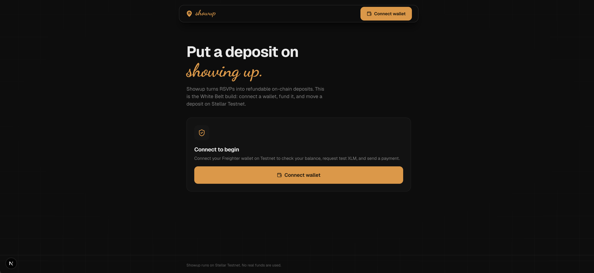
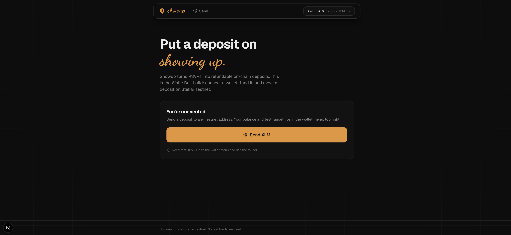
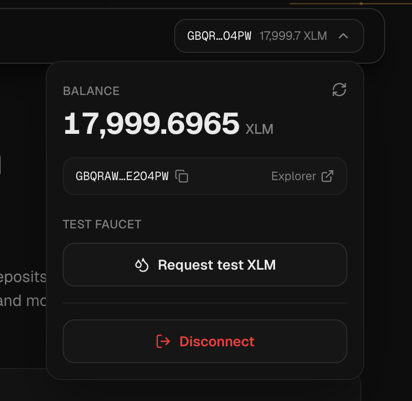
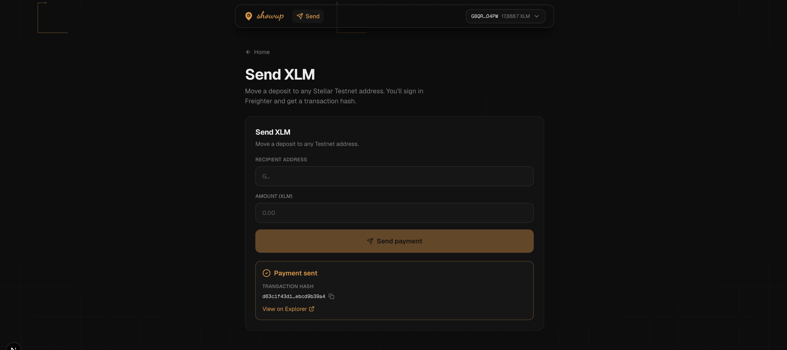

# Showup

**Put a refundable deposit on showing up.** Showup turns event RSVPs into
on-chain deposits on [Stellar](https://stellar.org): reserve your spot with a
small deposit, check in at the event, and reclaim it. No-shows forfeit — so the
people who actually show up are the ones who get rewarded.

It's the anti-flake primitive for meetups, study groups, game nights, and calls —
a "skin in the game" layer that a group chat can never enforce.

> **Network:** Stellar **Testnet** only. No real funds are used.

<!-- Live demo and video links go here once deployed (Vercel). -->
- **Live demo:** _coming soon_
- **Repo:** this repository

<p align="center">
  
</p>

---

## Level 1 — White Belt

The White Belt build is the **deposit primitive** before the contracts exist:
a production-grade Stellar Testnet dApp that connects a wallet, shows a balance,
tops it up from a faucet, and moves a deposit with full transaction feedback.

**Features**

- **Freighter wallet** connect / disconnect on Testnet, with silent reconnect.
- **Balance** fetched from Horizon and shown in a wallet menu, with copy-address
  and Stellar Explorer links.
- **Built-in faucet** — fund a new account with 10,000 test XLM via Friendbot,
  with honest "already funded" messaging.
- **Send XLM** to any address with client-side validation, wallet signing, and a
  **transaction hash + Explorer link** on success.
- **Robust error handling** — wallet not found, request rejected, wrong network,
  underfunded, non-existent destination, and stale-sequence retries — all mapped
  to friendly copy.
- **Uber-like UI** — flat dark theme, a single warm-amber accent, a floating
  liquid-glass navbar, and a subtle pointer-driven grid trail.

**Screenshots**

| Wallet connected | Balance + faucet |
| :--: | :--: |
|  |  |

| Successful transaction |
| :--: |
|  |

---

## Tech stack

- **[Next.js 16](https://nextjs.org)** (App Router) + **TypeScript**
- **[Tailwind CSS v4](https://tailwindcss.com)** (class-based dark mode)
- **[@stellar/stellar-sdk](https://github.com/stellar/js-stellar-sdk)** — Horizon
  queries, transaction building & submission
- **[@stellar/freighter-api](https://github.com/stellar/freighter)** — wallet
  connection & signing
- **[lucide-react](https://lucide.dev)** — line icons
- Deployed on **[Vercel](https://vercel.com)** (Root Directory = `web`)

---

## Getting started

### Prerequisites

- **Node.js 20+** and npm
- The **[Freighter](https://www.freighter.app)** browser extension, set to the
  **Test SDF Network / Testnet**

### Run locally

```bash
cd web
npm install
npm run dev
```

Open [http://localhost:3000](http://localhost:3000).

1. **Connect wallet** (top right) — approve the connection in Freighter.
2. Open the wallet menu and hit **Request test XLM** if your account is new.
3. Go to **Send**, enter a destination and amount, and **Send payment**.
4. Copy the **transaction hash** or open it on **Stellar Explorer** to verify.

---

## How it works (L1)

```
Freighter ──connect──▶ Showup ──loadAccount──▶ Horizon (Testnet)
    │                     │
    │                     └──friendbot?──▶ fund new account (10,000 XLM)
    │
    └──sign payment XDR──▶ Showup ──submitTransaction──▶ Horizon ──▶ tx hash
```

Payments are built with `TransactionBuilder`, signed in Freighter, and submitted
to Horizon. The returned hash links straight to Stellar Explorer.

---

## Roadmap

Showup grows one belt at a time; a git tag marks each level.

- [x] **L1 — White Belt** · wallet, balance, faucet, payments _(this build)_ — `v1-white`
- [ ] **L2 — Yellow Belt** · first Soroban contract: RSVP deposit, check-in, claim + live event feed
- [ ] **L3 — Orange Belt** · factory + reputation contracts, CI/CD, tests, docs
- [ ] **L4 — Green Belt** · production MVP, real users, analytics, feedback

---

## License

MIT
