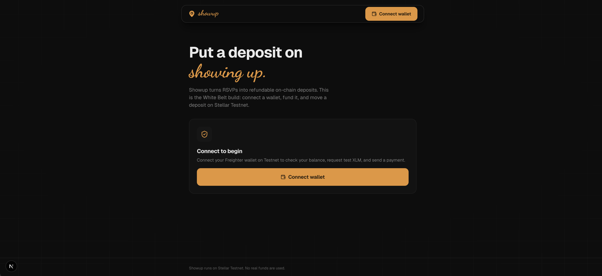
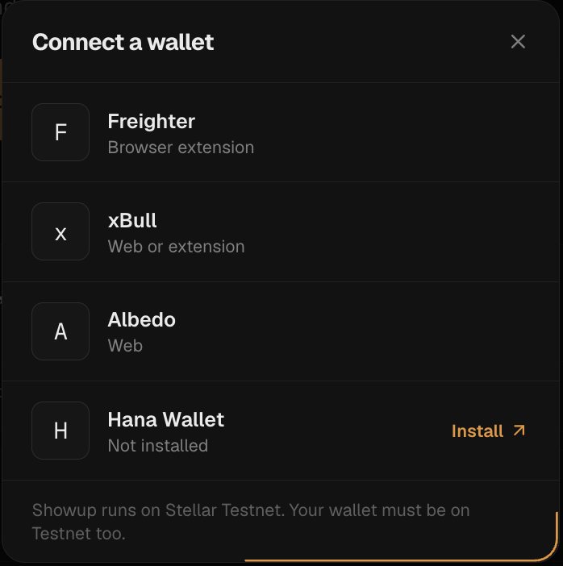
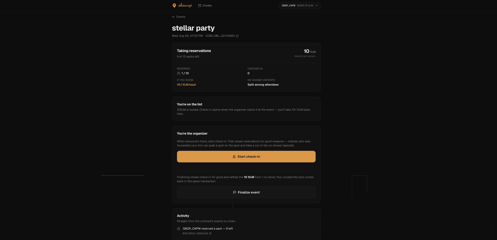
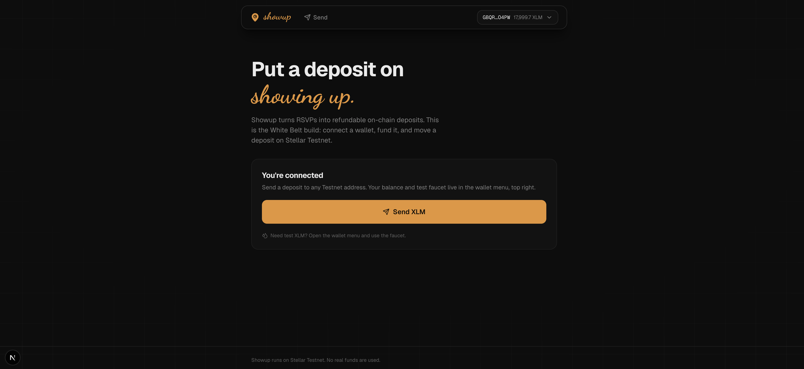
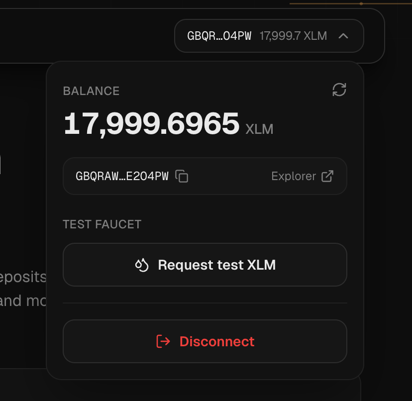
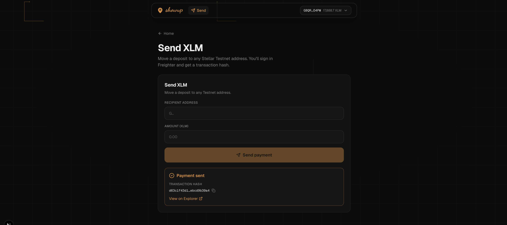

# Showup

**Put a refundable deposit on showing up.** Showup turns event RSVPs into
on-chain deposits on [Stellar](https://stellar.org): reserve your spot with a
small deposit, check in at the event, and reclaim it. No-shows forfeit — so the
people who actually show up are the ones who get rewarded.

It's the anti-flake primitive for meetups, study groups, game nights, and calls —
a "skin in the game" layer that a group chat can never enforce.

> **Network:** Stellar **Testnet** only. No real funds are used.

[](https://github.com/lukascakici/showup/actions/workflows/ci.yml)

- **Live demo:** **[showup.click](https://showup.click)**
- **Demo video:** _coming with the real event run_

<p align="center">
  
</p>

This README is organised by the three deliverables it is built against, in order.
It is cumulative: it grows as things ship, and nothing that shipped ever
disappears from it.

| Deliverable | What it is | State |
| :-- | :-- | :-- |
| **[1](#deliverable-1--a-deployed-multi-wallet-dapp-with-ci)** | A deployed multi-wallet dApp, with CI on every push | shipped |
| **[2](#deliverable-2--the-on-chain-reputation-contract)** | An on-chain `reputation` contract, written by the events themselves | shipped |
| **[3](#deliverable-3--one-real-event-10-real-attendees-a-demo-video)** | One real event, 10+ real attendees, a demo video | run complete · video pending |

Reviewing rather than reading? **[docs/SOW1](docs/SOW1/)** has one short page per
deliverable, written against SOW §6.1 and readable without a technical
background. The sections below are the same record with the engineering in it.

---

## Deliverable 1 — a deployed multi-wallet dApp, with CI

The app people actually touch: connect any of five Stellar wallets, get funded,
create an event, reserve a spot, check in, and reclaim — with a transaction hash
for every step.

### Features

**Wallets, balances and payments**

- **Five wallets** — Freighter, xBull, Albedo and Hana via
  [StellarWalletsKit](https://github.com/Creit-Tech/Stellar-Wallets-Kit), plus
  **WalletConnect**, behind a flat picker of our own rather than the kit's modal,
  with silent reconnect.
- **Balance** fetched from Horizon and shown in a wallet menu, with copy-address
  and Stellar Explorer links.
- **Built-in faucet** — fund a new account with 10,000 test XLM via Friendbot,
  with honest "already funded" messaging.
- **Send XLM** to any address with client-side validation, wallet signing, and a
  **transaction hash + Explorer link** on success. *Shipped in week 1 and
  **removed on 07.08.2026** — it was a standalone payment tool from before the
  contracts existed, and once every deposit moves through an event contract there
  was nothing left for it to do. The screenshot below stays as the record of it.*
- **Robust error handling** — wallet not installed, request rejected, pop-up
  blocked, wrong network, underfunded, non-existent destination, stale-sequence
  retries and every contract error code, all mapped to plain-language copy. Each
  wallet reports failure differently and none of them throw an `Error`, so the
  mapping is written against the shipped source of all five.
- **Uber-like UI** — flat dark theme, a single warm-amber accent, a plain solid top
  bar, and a subtle pointer-driven grid trail. No gradients, no glassmorphism.

**Events, end to end**

- **Create an event** — name, start time, deposit, capacity and a forfeit policy.
  The factory deploys a fresh contract and funds its fee pool in one transaction.
- **The moment after creating** hands over both links rather than redirecting: the
  **invite link** (safe to post anywhere) and the **check-in link** (which is the
  organizer's only backup of a code nobody, including us, can recover), each with
  a QR code.
- **Reserve, check in, finalize** — every action is a signed contract call with its
  hash on screen and a link to Stellar Expert.
- **An activity feed** read back from the contract's own on-chain events, showing
  the transaction hash of each one rather than its ledger number.
- **The event list** is sorted by when events start and grouped by day — Today,
  Tomorrow, then dates, then Earlier — rather than by the order the factory
  happened to register them.

**Getting a stranger from a link to a reservation**

Everything in this group exists because Deliverable 3 depends on ten people who
have never used Stellar finishing this on their own phone, unattended.

- **A cold visitor gets an explanation before a signature request** — what a
  deposit is, in three steps, with this event's own numbers, and the fact that
  Testnet XLM is not real money and the faucet is free.
- **The funding pre-flight** asks whether an account can afford the deposit
  *before* the wallet prompt, and offers the faucet in the same card when it
  can't. It withholds the 1 XLM base reserve Stellar locks in every account and
  never lets it be counted as spendable — the reason a balance of exactly 10
  cannot pay a 10 XLM deposit.
- **A wrong-network banner** naming the wallet, the network it is on, and the fix.
  It is a warning rather than a lock, and it can be told to check again.
- **No dead ends in the wallet picker** — install links for what is missing, a
  "check again" for after you install something, and advice that changes with the
  device, since "install the extension" is useless on a phone.

**Honest states everywhere**

- **Loading, empty and broken are three different things**, and are no longer
  rendered as one. A feed that is still loading does not claim the event has no
  history; a failed read does not claim the event does not exist; numbers that
  have stopped updating say so instead of sitting there looking live.
- **`restoring`** — the app knows the difference between "nobody is connected" and
  "we haven't finished asking", so a returning visitor stops seeing a connect
  button flash before their wallet appears.

**Built for a phone**

The home page, the create page, a live event page and the wallet picker are each
measured at 280, 320, 375 and 390 px wide and in landscape, by a script that
drives a real browser: 16px inputs so iOS never force-zooms a form, 44px tap
targets, a picker that scrolls instead of putting its own button off-screen, and
no horizontal scroll anywhere.

**Continuous integration**

Every push runs two jobs. **Contracts:** pinned Rust toolchain, `cargo fmt
--check`, build the wasm *before* clippy and tests (the event tests
`contractimport!` it), a check that the committed TypeScript bindings still match
the contract source, a check that **the wasm hash published in this README is
what the deployed factory actually deploys** — asked of the live chain, not of a
local build — then clippy with `-D warnings`, then 60 contract tests. **Web:**
lint with `--max-warnings=0`, typecheck, 137 tests, build.

### Architecture

```
showup/
├── contracts/
│   ├── interfaces/        # #[contractclient] traits + shared constants (lib only)
│   ├── event/             # one deployed contract per event: deposits, phases, refunds
│   ├── factory/           # deploys events, funds fee pools, registers them for scoring
│   └── reputation/        # the show-up ledger (Deliverable 2)
├── web/
│   └── src/
│       ├── app/           # Next.js App Router: /, /create, /e/[id], /api/events/sync
│       ├── components/    # UI; the states worth pinning have component tests
│       ├── lib/           # chain reads, wallet kit, contract clients, pure helpers
│       └── test/          # test-only helpers (a controllable matchMedia)
├── docs/
│   ├── deployments.md     # every address, every hash, what each one cost
│   └── screenshots/
└── .github/workflows/ci.yml
```

| Setting | Value | Why |
| :-- | :-- | :-- |
| Node | **24** | pinned in `web/package.json`, matched by CI and Vercel |
| Rust target | **`wasm32v1-none`** | what Soroban runs |
| Workspace profile | **`lto = false`** | `lto = true` miscompiles some `soroban-sdk` builds |
| Vercel Root Directory | **`web`** | the repo is a monorepo; the Next app is one subtree |
| Package manager | **npm** | the lockfile CI installs from |
| Inter-contract calls | via the **`interfaces`** crate | depending on another *contract* crate pollutes the wasm spec |

`NEXT_PUBLIC_WALLETCONNECT_PROJECT_ID` is the one environment variable the app
needs, and it is public by design — it identifies the app to the WalletConnect
relay and ships in the client bundle. Without it, the WalletConnect row simply
isn't offered; everything else works.

### Evidence

SOW §6.1 asks Deliverable 1 for a live link, a repo with CI passing, and two
screenshots — the wallet-selection dialog, and a completed transaction with its
hash and Explorer link.

| What | Where |
| :-- | :-- |
| Live link | **[showup.click](https://showup.click)** |
| CI passing | [the badge above](https://github.com/lukascakici/showup/actions/workflows/ci.yml), green on every push |
| Wallet-selection dialog | below |
| A completed transaction, with its hash and Explorer link | below |

| The wallet picker | An event created, with its transaction hash |
| :--: | :--: |
|  |  |

The picker was captured in week 1, so it shows the four wallets offered then;
WalletConnect was added in week 3 and appears as a fifth row on the live site.

The transactions behind the second screenshot were made **through the app's own
UI and signed in a browser wallet**, not from the CLI — which is the part a
screenshot alone cannot prove:

[`CCBELUML…CDYA4G6X`](https://stellar.expert/explorer/testnet/contract/CCBELUML3QPYDXC7RSQUD3GPDCZ6P3DZYORTY6MCBRMIHFKLCDYA4G6X) — *"stellar party"*, 10 XLM deposit, capacity 10

| Action | Transaction |
| :-- | :-- |
| `create_event` | [`ca6c5474…f5104ffe`](https://stellar.expert/explorer/testnet/tx/ca6c547481a3704198f027157acba1bfd4f3b45f14210039daa06c97f5104ffe) |
| `rsvp` — the row visible in the screenshot | [`03d15919…416de3c8`](https://stellar.expert/explorer/testnet/tx/03d159194db4242e884c2b85d00fb4ea7c729e0b4684ec5e7e8ee35a416de3c8) |

| Wallet connected | Balance + faucet |
| :--: | :--: |
|  |  |

| Successful transaction — from the send tool, since removed |
| :--: |
|  |

Taking the `event-created.png` screenshot took two attempts and changed the
product, which is worth recording rather than tidying away. The first attempt
showed `ledger 4056613` where a hash should have been — activity rows linked to
Stellar Expert but printed the ledger number, so the evidence was in the href and
nowhere a reader could see it. The same screenshot showed the heading `Event` on
an event that by then had a name on-chain, because the detail page had never been
taught to read `title`. Both are fixed. The screenshot requirement found two real
gaps that the tests did not.

---

## Deliverable 2 — the on-chain `reputation` contract

A show-up score that only the chain can write. It rises when someone checks in
and falls when a finalised event finds them missing — in the **same transaction**
as the money it describes, so the score and the settlement can never disagree.

### Features

- **`record_checkin` / `record_no_show`** — called by an event contract, never by
  a person and never by the frontend. The app has no code path that writes a
  score at all.
- **Factory-gated.** `register_event` accepts a registration only when the caller
  is the factory this ledger was pointed at, so a score can only ever be the
  consequence of an event the factory itself deployed. Anything else is refused
  on-chain with `NotAnEvent`.
- **`get_score(member)`** returns `{ shows, no_shows }` — read by anyone, written
  by nobody outside that gate.
- **Written atomically with the settlement.** `check_in` refunds the deposit *and*
  raises the score in one invocation; `finalize` moves the forfeited deposits,
  returns the unspent fee pool *and* lowers the flakes' scores in one more. There
  is no window in which the money has moved and the record has not.
- **Inter-contract calls go through the `interfaces` crate** — `#[contractclient]`
  traits, never a dependency on another contract crate, which would drag that
  contract's whole spec into this one's wasm.
- **Admin-gated `set_factory` and `upgrade`** on the ledger, and
  `set_event_wasm_hash`, `set_reputation` and `upgrade` on the factory. The v1
  factory had none of these and had to be replaced to add scoring at all; that
  mistake is now unrepeatable.
- **State rent is paid deliberately.** Instance and persistent entries extend
  their own leases on write, to 90 days, past a 30-day threshold — after a week 2
  incident in which contract state simply expired.
- **The event contract deliberately has no `upgrade`.** A deployed event holds
  other people's deposits under rules they agreed to; being able to rewrite those
  rules afterwards is not a feature.

### Deployed contracts (Testnet)

| What | Address |
| :-- | :-- |
| **Event factory** | [`CD5AEMRB35FBZKO24562DRITAY337CMBXGF6HVSUDRKWHE4RKQLE7FCE`](https://stellar.expert/explorer/testnet/contract/CD5AEMRB35FBZKO24562DRITAY337CMBXGF6HVSUDRKWHE4RKQLE7FCE) |
| **Reputation ledger** | [`CDFGVEIJDNCTGN2F6VN47QFDWTGTKJMBNBEETAWGZ5RV7GDYPEOLA3DJ`](https://stellar.expert/explorer/testnet/contract/CDFGVEIJDNCTGN2F6VN47QFDWTGTKJMBNBEETAWGZ5RV7GDYPEOLA3DJ) |
| **Event wasm hash** | `8fe992b8209d298ecc7c2e2bd882f8fe6412572ef39bdbbf29a687bc69c10949` |
| **Native XLM SAC** | `CDLZFC3SYJYDZT7K67VZ75HPJVIEUVNIXF47ZG2FB2RMQQVU2HHGCYSC` |

That wasm hash is checked against the live factory by CI on every push, so it
cannot quietly drift out of date.

The factory holds the event wasm hash and deploys a fresh event contract per
organizer, so the frontend only ever has to know one address. It is also the root
of trust for scoring: the reputation ledger accepts registrations from this
factory and nobody else.

The original factory (`CAI5RQZF…CA7JD3CW`) is superseded but still live and still
verifiable — its full end-to-end run is kept intact. Full deployment record,
including why the address changed and what it cost, is in
**[docs/deployments.md](docs/deployments.md)**.

### Evidence

One event, run to the end by three separate accounts, with a score rising and
falling on-chain. Every hash below opens on Stellar Expert.

| Step | Transaction | What the chain shows |
| :-- | :-- | :-- |
| `create_event` | [`5feeec69…946240`](https://stellar.expert/explorer/testnet/tx/5feeec693c7f674e4c41457714ade03904f2846663606f98fac8b8b845946240) | event deployed, fee pool funded, **and `event_registered` published by the reputation ledger in the same transaction** |
| `rsvp` (the guest who showed) | [`64ebd04c…d5fffa`](https://stellar.expert/explorer/testnet/tx/64ebd04cec719183e6fe0a0d594b302f9a97c3ff632dc0891e057fa0c1d5fffa) | 10 XLM locked, `spots_left: 1` |
| `rsvp` (the guest who flaked) | [`6714a855…d5da56`](https://stellar.expert/explorer/testnet/tx/6714a8553fd6760b612d69aa7c59edfd7088d3a867dc5c22000a082db3d5da56) | 10 XLM locked, `spots_left: 0` |
| `open_checkin` | [`5f84bc62…b428aa`](https://stellar.expert/explorer/testnet/tx/5f84bc626a59da7e37abee0c01526273a9b1947b7311a6279b62a2392fb428aa) | `PhaseChanged { phase: CheckingIn }` |
| **`check_in` — the score rises** | [**`c76cd351…fd9357`**](https://stellar.expert/explorer/testnet/tx/c76cd351f2645c2aec78f1e7b9687ada167790fbb9d8151af9a9dae0cefd9357) | 10.1 XLM returned **and** `score_changed { shows: 1, no_shows: 0 }` |
| **`finalize` — the score falls** | [**`5d394178…7019dc`**](https://stellar.expert/explorer/testnet/tx/5d394178e5a9d58933ffa58b93ed1ce853c39ff3749f307c8b615e638f7019dc) | forfeited 10 XLM to the guest who showed, 0.1 XLM unspent pool back to the organizer, **and `score_changed { shows: 0, no_shows: 1 }`** |

The gate was tested by attacking it, not by asserting it: a `record_checkin` from
an address the factory never registered is refused on-chain with
`Error(Contract, #3)` — `NotAnEvent` — and a `set_factory` from a non-admin never
even reaches submission, because the simulation demands the admin's signature.

The scores read back from the contract afterwards, the three account balances
before and after, and a full re-verification of every claim above against the
live chain are all in **[docs/deployments.md](docs/deployments.md)**.

---

## Deliverable 3 — one real event, 10+ real attendees, a demo video

**The run is done; the video is not.** Real people, invited through the live
site, reserving real Testnet deposits from their own wallets and checking in on
their own phones.

Everything in Deliverable 1's "getting a stranger from a link to a reservation"
exists for this: each person who gave up would have been a missing row in the
table below, and there was only one attempt.

It ran remotely — there is no venue. People took part from wherever they were:
they opened a link, reserved, and checked in on their phone.

### Evidence

Run on **23.08.2026**. Twelve people reserved within about an hour of the
invitation, **eleven checked in**, one did not — and that one no-show is what
makes the forfeit split and the reputation ledger visible rather than theoretical.

- [x] **10+ distinct attendee wallet addresses**, each with its `rsvp` and
      `check_in` transaction hashes — **12 reserved, 11 checked in**, every hash
      in [docs/deployments.md](docs/deployments.md#deliverable-3-evidence--one-real-run-12-wallets-11-check-ins)
- [x] **The finalised event's contract address**, openable on Stellar Expert —
      [`CAOK5LME…EWMUTLJL`](https://stellar.expert/explorer/testnet/contract/CAOK5LMEBEFHYWXLD5D55U46E73FD5ZTTBBBMMQIBMLYXTZWEWMUTLJL)
- [ ] **A demo video** of the full flow: create → invite → reserve → check in →
      finalize → reclaim

| | |
| :-- | :-- |
| Event | *"coffee time"* · `CAOK5LMEBEFHYWXLD5D55U46E73FD5ZTTBBBMMQIBMLYXTZWEWMUTLJL` |
| `create_event` | [`740f54dc…5cfc75`](https://stellar.expert/explorer/testnet/tx/740f54dce873103569473f19520a0392099d7cfe1afc9eb7717890f44d5cfc75) |
| Check-in opened | [`dfed9632…1d3337`](https://stellar.expert/explorer/testnet/tx/dfed9632e7a48b09413c1eb715d4957a11678c9103a4e93a02440e00d31d3337) |
| `finalize` | [`d9cd8c8f…7699dd`](https://stellar.expert/explorer/testnet/tx/d9cd8c8f078c3582dc7f0b343a3fcaa64468c71ae9df6db5a7ac5161aa7699dd) |
| Reserved / checked in | 12 / 11 |
| Returned to each attendee | **5.10 XLM** against a 5.00 deposit |
| Forfeited and split | 5.00 XLM among the eleven who showed |
| Left in the contract | **0** |

It ran remotely, which is the part worth being precise about: there was no room
and no gathering. Twelve people opened a link in a group chat, installed a wallet
themselves, funded it from the faucet, locked a real Testnet deposit, and checked
in from their own phones — unattended, with nobody standing next to them. That is
the flow [Deliverable 1](#deliverable-1--a-deployed-multi-wallet-dapp-with-ci)
was built for, and this is the first time it was asked to survive strangers.

**None of the table above was typed by hand.**
[`web/scripts/collect-evidence.mjs`](web/scripts/collect-evidence.mjs) reads
every `reserved`, `checked_in`, `phase_changed` and `finalized` event straight
off the chain and prints it as markdown — `npm run evidence -- <event>` from
`web/` reproduces this section, and disagrees with it if anyone edits a hash.

---

## Tech stack

- **[Next.js 16](https://nextjs.org)** (App Router) + **TypeScript**
- **[Tailwind CSS v4](https://tailwindcss.com)** (class-based dark mode)
- **[Soroban](https://developers.stellar.org/docs/build/smart-contracts) / Rust**
  with `soroban-sdk`, built for `wasm32v1-none` with the `stellar` CLI
- **[@stellar/stellar-sdk](https://github.com/stellar/js-stellar-sdk)** — Horizon
  queries, transaction building & submission
- **[StellarWalletsKit](https://github.com/Creit-Tech/Stellar-Wallets-Kit)** — wallet
  connection & signing across Freighter, xBull, Albedo, Hana and WalletConnect
- **Generated TypeScript bindings** via `stellar contract bindings typescript`,
  committed and checked against the contract source by CI
- **[Vitest](https://vitest.dev)** + jsdom + **[Testing Library](https://testing-library.com)**
  — frontend unit and component tests
- **[lucide-react](https://lucide.dev)** — line icons
- Deployed on **[Vercel](https://vercel.com)** (Root Directory = `web`)

---

## Getting started

### Prerequisites

- **Node.js 24** and npm (pinned in `web/package.json`, matching CI and Vercel)
- A Stellar wallet on the **Test SDF Network / Testnet**. Any of
  **[Freighter](https://www.freighter.app)**, **[xBull](https://xbull.app)**,
  **[Albedo](https://albedo.link)** or **[Hana](https://hanawallet.io)** — xBull and
  Albedo need nothing installed, they open in a pop-up.
- For the contracts only: **Rust** with the `wasm32v1-none` target and the
  **[`stellar` CLI](https://developers.stellar.org/docs/tools/developer-tools/cli/stellar-cli)**.
  You do not need either of these to run the app against the deployed contracts.

### Run the app

```bash
cd web
npm install
npm run dev
```

Open [http://localhost:3000](http://localhost:3000). It talks to the contracts
already deployed on Testnet, so there is nothing to deploy first.

1. **Connect wallet** (top right) — pick a wallet and approve the connection.
2. Open the wallet menu and hit **Request test XLM** if your account is new.
3. Go to **Create**, set a name, a deposit, a capacity and a forfeit policy, and
   create the event — the factory deploys it and funds its fee pool in one
   transaction.
4. Copy the **invite link** from the screen that follows and open it in another
   browser to reserve a spot as a guest.
5. Copy the **transaction hash** of any action, or open it on **Stellar Expert**,
   to verify it happened.

### Build the contracts

```bash
stellar contract build --locked
cargo test --workspace
```

Deploying your own copy — and why each step is in the order it is — is written
out in **[docs/deployments.md](docs/deployments.md)** under *Reproducing*.

---

## Testing

```bash
cargo test --workspace     # 60 contract tests
cd web && npm run test:run # 137 frontend tests
```

**Contracts — 60 tests.** 32 on the event contract (deposits, phases, capacity,
wrong codes, double check-in, forfeit splitting, the organizer-vanished fallback),
14 on the factory (deployment, fee funding, admin gating, the wasm-hash setter)
and 14 on the reputation ledger (the factory gate, scoring in both directions,
non-admin refusals).

**Frontend — 137 tests.** 76 over pure logic — stroop arithmetic, byte-counted
titles, the day-grouping the event list uses, the funding pre-flight's base-reserve
arithmetic, wallet-error mapping, link building — and 61 that render components.
The component tests deliberately cover the states that are hard to reach by hand,
because reaching them means making the network fail on cue or owning a wallet
deliberately set to the wrong chain: loading versus empty versus broken, "this
event does not exist" versus "we could not ask", the wrong-network banner, and
both halves of the wallet picker's device-dependent advice.

---

## Network

Stellar **Testnet** only (`Test SDF Network ; September 2015`). Mainnet is
explicitly out of scope, as are non-XLM assets and fee sponsorship.

```
Wallet ──connect──▶ Showup ──loadAccount──▶ Horizon (Testnet)
    │                  │
    │                  └──friendbot?──▶ fund new account (10,000 XLM)
    │
    └──sign contract XDR──▶ Showup ──Soroban RPC──▶ event contract ──▶ tx hash
```

Balances and the faucet go through Horizon; everything that moves a deposit goes
through a Soroban contract call, signed in the connected wallet and submitted over
Soroban RPC. Either way the returned hash links straight to Stellar Explorer.

---

## Roadmap

Showup is being built as a 30-day [Instawards](https://stellar.org) engagement with
the Stellar Türkiye chapter, in four weeks. This README grows with it — nothing that
shipped ever disappears from the record.

- [x] **Week 1** · four wallets via StellarWalletsKit, every failure mode in plain
      language, public deployment, GitHub Actions CI on every push
- [x] **Week 2** · on-chain `reputation` contract — a factory-gated show-up score,
      raised on check-in and lowered on a finalised no-show, written in the same
      transaction as the money it describes
- [x] **Week 3** · product pass: the post-create hand-off with invite and check-in
      links and QR codes, honest loading/empty/error states, a measured mobile
      pass, the whole path from a link to a reservation for someone with no wallet,
      a sorted event list, component tests, and these docs
- [ ] **Week 4** · one real event with 10+ real attendees, every transaction hash
      recorded, and a demo video of the full flow — the run is done (12 reserved,
      11 checked in, every hash [recorded](#deliverable-3--one-real-event-10-real-attendees-a-demo-video));
      the video is the last thing outstanding

---

## License

MIT
