# Deliverable 3 — evidence

The product these mechanics need: the four admission modes made usable, names to
attach a record to, an explanation before anybody signs, and a conversation for the
people who have a spot.

> **SOW §6.1:** the public URL of the rebuilt app. Before-and-after screenshots of
> every screen, desktop and phone. A claimed display name appearing across the app,
> and the Firestore rules in the repo that make claiming one safe. A screen recording
> of first-run onboarding. A screenshot of the event conversation with confirmed
> guests in it. A 1-2 minute demo video of an event whose guest list was built by
> vouching.

Everything below is on Stellar **Testnet**. No real money is involved.

**Every screen below is live at [showup.click](https://showup.click)**, and every
image is a capture of it taken by `scripts/capture-screens.mjs` — the same script,
the same widths, the same waits, so a "before" and an "after" differ only by the
product. The demo video is filmed on the event run itself.

---

## What it does, in fifteen seconds

  <a href="https://youtu.be/0s9vVx6JVSg">
    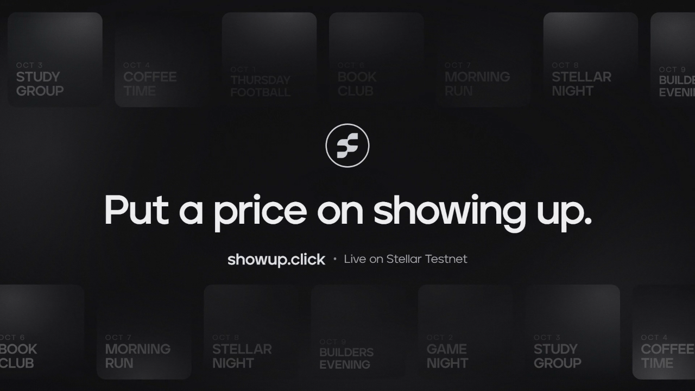
  </a>

**[youtu.be/0s9vVx6JVSg](https://youtu.be/0s9vVx6JVSg)** — an invite in a group chat,
a deposit locked to take the spot, the deposit back on check-in, and what that does
to turnout. The real screens are below.

---

## Before and after

The first engagement's screens, and the same screens now.

### The home page

| Before | After |
| :-- | :-- |
| 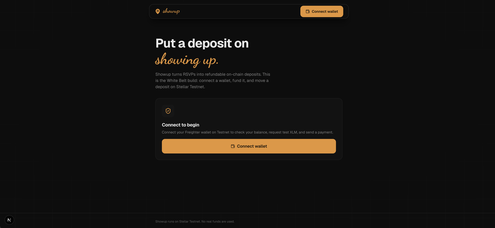 | 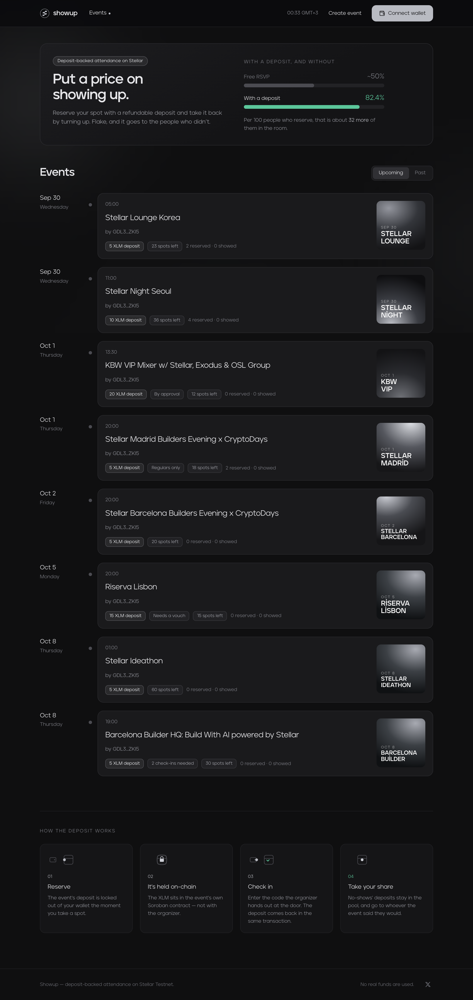 |

The list is the ecosystem's real calendar, grouped by day, and **every card says
whether you can get in at all** — `Regulars only`, `By approval`, `Needs a vouch`.
That is the single most important thing about an event now, and before this it was
not on the card.

### Connecting a wallet

| Before | After |
| :-- | :-- |
| 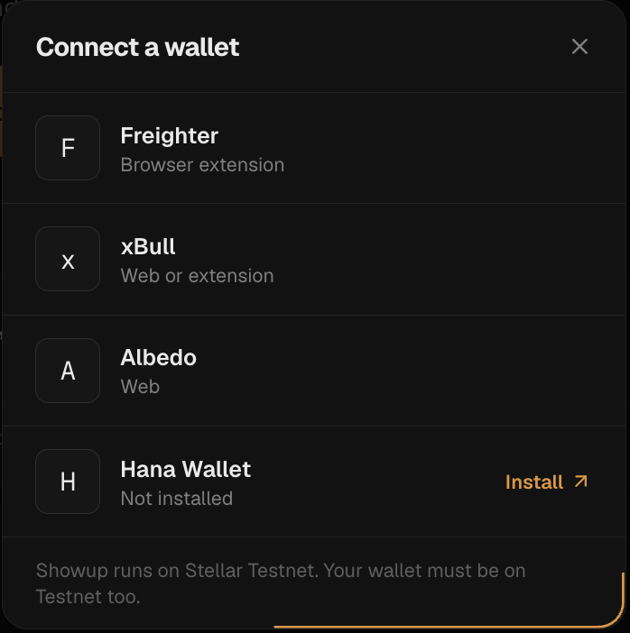 | 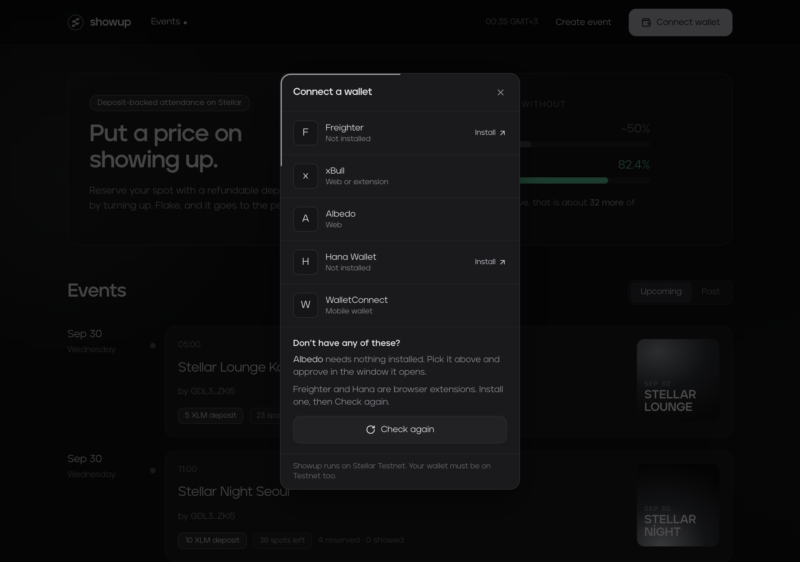 |
| 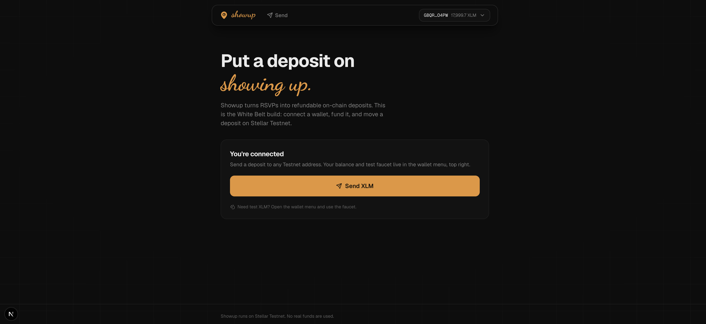 | 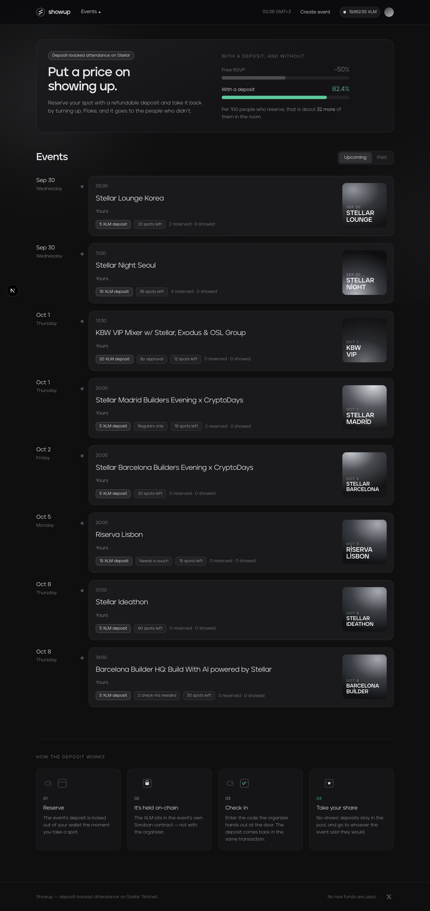 |

### The wallet menu

| Before | After |
| :-- | :-- |
| 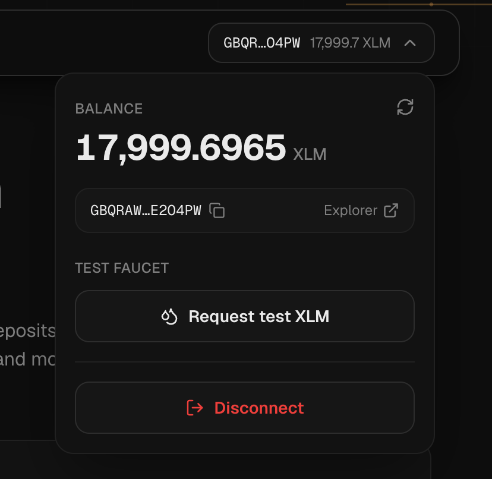 | 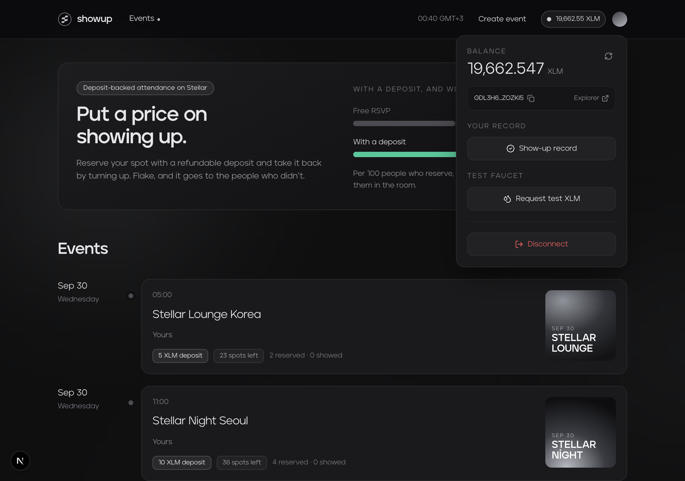 |

It gained one row: a link to **your own show-up record**. The ledger had been
readable from the chain since the first engagement and readable by a person since
this one.

---

## The screens that have no "before"

These did not exist in the first engagement, so there is nothing to pair them with.
They are the engagement.

### A gate that explains itself

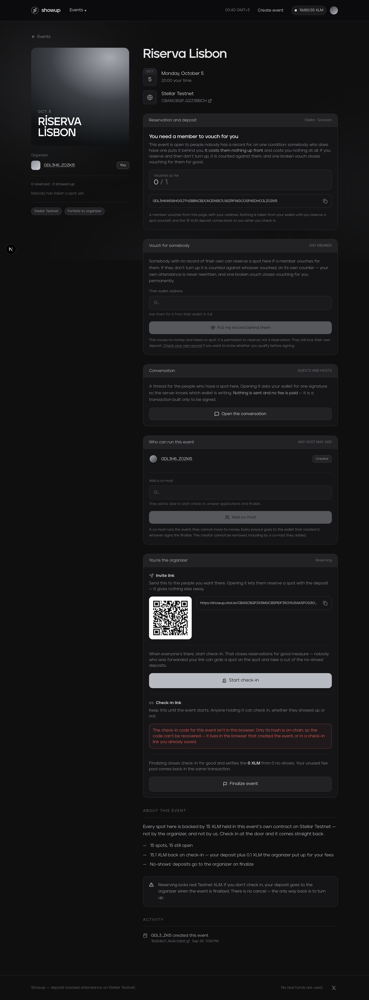

How many members have vouched for you, out of how many the event asks for, and a
form for any member to vouch from — **before any button asks for a signature.**

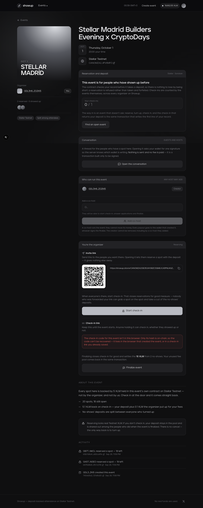

Your own check-ins against the threshold, and the sentence that answers the real
question: a refusal costs nothing, because the reservation is refused rather than
taken and forfeited.

### The organizer's own view

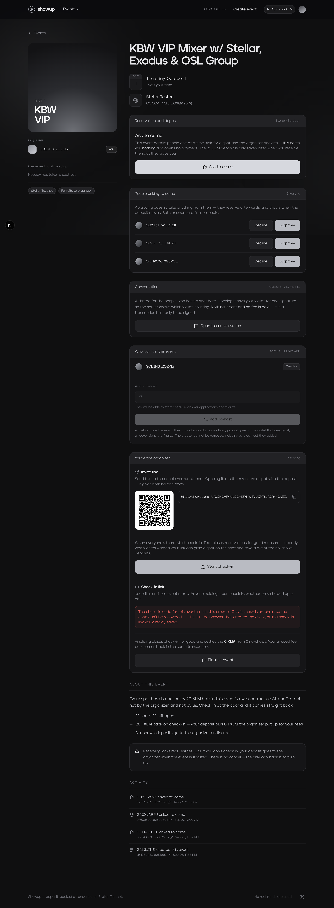

One screen carrying four things built this engagement: the **queue of people asking
to come** with both answers, the **conversation** for the people holding a spot,
**who can run this event** with co-hosts addable and removable, and the invite link
with its QR.

### A wallet's record, openable by anyone

| It has one | It has none |
| :-- | :-- |
| 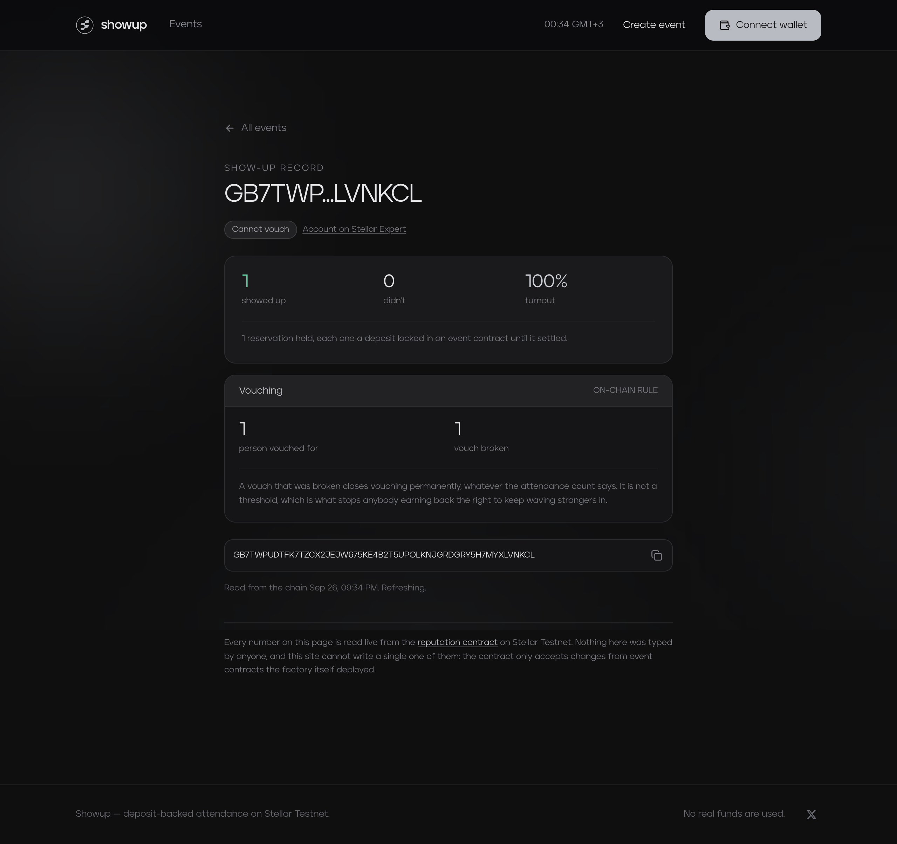 | 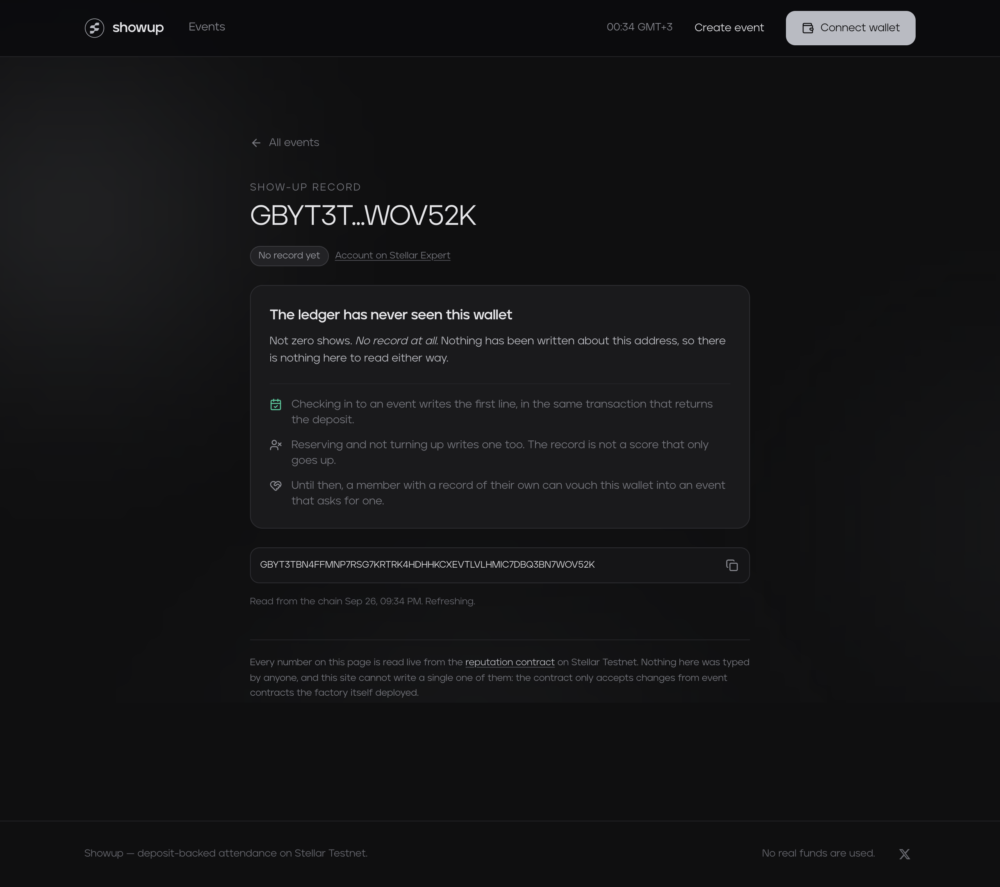 |

The right-hand one is the careful case: **"no record" and "zero shows" are different
claims**, and the page makes the one that is true.

### The deposit, explained before it is asked for

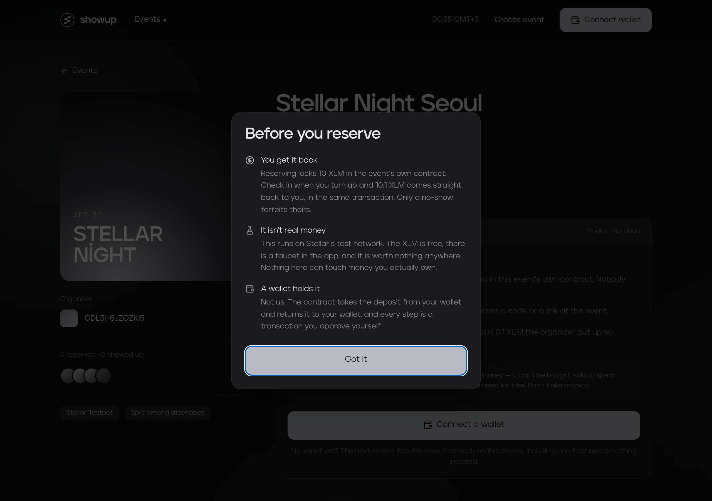

### Creating an event

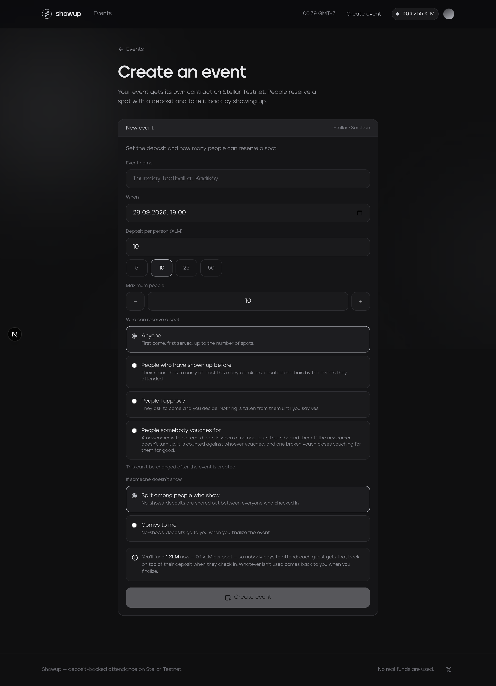

Four admission modes, and only the chosen mode's number appears.

---

## The app

**[showup.click](https://showup.click)** — built · every screen below is live.

| Screen | What shipped |
| :-- | :-- |
| Home | Events grouped by day, each card saying **whether you can get in at all** — `Regulars only`, `By approval`, `Needs a vouch`. The default mode stays unlabelled, so the one row that carries information is not diluted. |
| Event page | All four admission modes read honestly. A score-gated event shows your own check-in count against the threshold **before the button**; a vouch-gated one shows how many members have backed you and lets any member vouch. |
| Create | The four modes, with only the chosen mode's number appearing. Co-hosts addable and removable from the event page. |
| `/u/<address>` | A wallet's whole record, read from the chain, openable by anyone. See [deliverable-2.md](deliverable-2.md). |

### The refusals a guest used to meet as a failed transaction

Both gated modes used to be enforced on-chain and unexplained in the interface, so a
guest below the bar met the gate as a **wallet prompt followed by a contract
error**. Both now put the numbers in front of the button:

- **Score** — your check-ins, the threshold, and the sentence that actually answers
  the question: a refusal costs nothing, because the reservation is refused rather
  than taken and forfeited.
- **Vouch** — how many members have vouched for you out of how many are needed, your
  address ready to send to somebody who can, and a form for any member to vouch from.

Neither shows a `0` it has not been told. A count that has not arrived renders as
*checking*, because a guest who has already been vouched for, shown a screen saying
nobody has, would go and ask again.

---

## Display names

**Built.** Optional by design: a wallet with no name reserves, checks in, vouches and
organizes exactly as before, and every screen falls back to the shortened address it
has always shown.

A name appears wherever a wallet does — the record page heading, an event's organizer
row, the host list, the approval queue, the conversation — and the full address stays
on hover, because a name is a label somebody chose and the address is what the chain
knows.

### What makes claiming one safe

A display name is **the only thing in this app a person authors**, which makes it the
only thing needing a real answer to "who is asking". It sits next to somebody's
attendance record and in an organizer's approval queue, so a name claimed for a
wallet you do not hold is an impersonation the interface would perform on your behalf.

The proof is a **challenge transaction**, and the reason it is not a signed message
is worth stating: **Albedo, one of the four wallets this project promises, has
`signMessage()` stubbed out as SEP-0043 incompatible.** Building on it would have
left a quarter of users unable to have a name, and they would have been the ones to
find out.

So: the server issues a transaction sourced from the claimed account carrying a
one-use nonce, the wallet signs it, and the server verifies the signature **against
that account's own public key** before writing anything. Nothing is ever submitted,
no fee is paid, and the screen says so before the prompt appears.

| Where to look | |
| :-- | :-- |
| The rules | [`firestore.rules`](../../firestore.rules) — `names` is readable and **not writable by any client**; the nonces are neither |
| The proof | [`web/src/lib/wallet-proof.ts`](../../web/src/lib/wallet-proof.ts) — one implementation, shared with the conversation |
| The route | [`web/src/app/api/names/route.ts`](../../web/src/app/api/names/route.ts) |

Each check closes a named door, and the file says which: signature against the
claimed key, nonce issued here for this address and purpose, spent once, expires.

---

## First-run onboarding

**Built.** Three things before anybody is asked to sign, **using the event's own
numbers rather than an example** — "a deposit is refunded when you attend" is a
sentence about software, and "your 10 XLM comes back when you check in" is a sentence
about their money.

1. **You get it back.** The only question anybody has, answered first.
2. **It isn't real money.** Testnet XLM is free and worth nothing anywhere. Said
   plainly and early, because somebody believing they are risking savings is a
   failure — and so is somebody believing the opposite of a real deposit later.
3. **A wallet holds it.** Last, because it is the step and not the reason.

Once per browser, dismissable from anywhere, and it still appears rather than
crashing in a browser that refuses storage. Pictured above.

The screen recording §6.1 asks for is filmed on the run, against a real event.

---

## The event conversation

**Built.** A thread scoped to one event, open to the people holding a spot in it and
to its hosts. No direct messages; the only moderation is a host removing a message
from their own event.

### Why membership is checked in a route and not in a Firestore rule

The plan for this said "with Firestore rules enforcing it rather than the interface
hiding it", and what shipped meets that requirement a different way — because the
obvious way is **weaker** here.

A Firestore rule can only reason about what is in Firestore. To gate on membership it
would have to read the *mirrored* event document, which is a snapshot: a guest list
that was true when the last sync ran. **The authority on who is holding a spot is the
event contract, and no rule can read a contract.** So a rule-based version would
enforce the right idea against the wrong source.

Instead, every request reads `get_reserved`, `get_checked_in` and the host list **off
the chain**, and [`firestore.rules`](../../firestore.rules) denies clients both reads
and writes on the collection — so there is no path to a message that does not go
through that check. A failed chain read refuses the request rather than falling back
to the snapshot.

Verified against the live chain on 26.09.2026, on a real event:

| Caller | Result |
| :-- | :-- |
| no session | `401` — sign in to read this conversation |
| the host | `200`, marked as host |
| a wallet the contract lists as reserved | `200` |
| **a wallet with a genuine session, not in the event** | **`403` — this conversation is for the people holding a spot** |
| a message claiming somebody else as its author | stored under the **session's** address, not the claimed one |

### The conversation, on the run

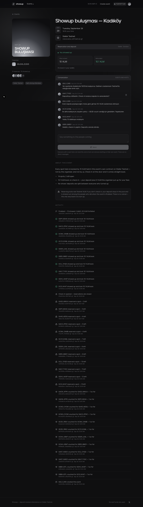

Taken on **[`CDK2UWJU…VRTOMYUD`](https://stellar.expert/explorer/testnet/contract/CDK2UWJUYI5OXFLPQVTJCW4VRXCRNY6U72G6N46VIRZ45MKFVRTOMYUD)**,
the vouch-gated run of 29.09.2026, from the seat of a guest who reserved and
checked in. Six messages, each stored under the address its session proved — the
organizer, someone asking how the check-in code is handed out, and a newcomer saying
they only got in because a member vouched for them.

The panel above it is that guest's own settlement: **was locked 10 XLM, refunded
10.1 XLM.** Both numbers are read from the event contract, not from the message
store.

---

## The run the guest list came from

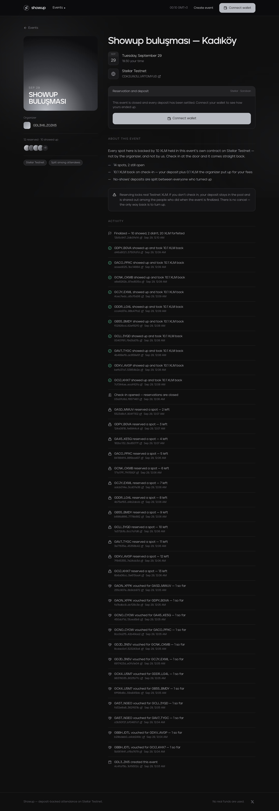

**[`CDK2UWJU…VRTOMYUD`](https://stellar.expert/explorer/testnet/contract/CDK2UWJUYI5OXFLPQVTJCW4VRXCRNY6U72G6N46VIRZ45MKFVRTOMYUD)** —
*Showup buluşması — Kadıköy*, 29.09.2026. `Admission::Vouch(1)`, 10 XLM a spot,
forfeits split among whoever turned up.

**Twelve spots, and not one of them could be taken without a member first putting
their own record behind the person.** Six members vouched, two guests each. Ten
turned up and took 10.1 XLM back; two did not, and their 20 XLM was split ten ways
in the same `finalize` that wrote their `no_shows` and charged the two members who
had backed them.

The activity list on that page is the whole run in order, every row carrying the
transaction that caused it. Every hash, every wallet and the settlement arithmetic
are in [deployments.md](../deployments.md#second-run--a-guest-list-built-entirely-by-vouching-29092026),
produced by `npm run evidence -- CDK2UWJU…` rather than typed.

| Before check-in opened | The same page, settled |
| :-- | :-- |
| [reserving](../screenshots/run/event-reserving-desktop.png) — 12 reserved, 0 showed up | [finalized](../screenshots/run/event-finalized-desktop.png) — 10 showed, 2 didn't, 20 XLM forfeited |

---

## Measurement

**Built.** Four steps are recorded — `invite_opened`, `wallet_connected`, `reserved`,
`checked_in` — because the interesting half of the funnel is invisible on-chain: the
chain knows who reserved, and has no idea how many people opened a link and closed
it. That gap is the case for the deposit.

`node scripts/funnel-report.mjs` prints the table from the rows. It states, rather
than smooths over, that the counts are **browser sessions and not people**: one
person on two devices is two, one with storage disabled is none. The last two steps
are also on-chain facts and are cross-checked against the contract, which is the
authority on them.

The identifier is a random per-browser string carrying no wallet, no IP and nothing
derived from the visitor — only enough to recognise one visit across four steps,
without which a drop-off cannot be computed at all.

---

## Mobile

**Built.** `node scripts/mobile-audit.mjs` runs in CI and checks the three faults
that have actually bitten this project: an input under 16px (which makes iOS Safari
zoom in and never back out), a tap target under 44px, and a fixed width wide enough
to leave a 320px screen. All three were real bugs here once.

It is explicit about what it cannot see — overlapping text, a heading that wraps
badly at 280px, a sheet that opens off-screen — because those still need somebody
looking at a phone.

---

## Every screen, both widths

20 screens, captured at **1280px and 390px** by
`node scripts/capture-screens.mjs` — one run, one set, reproducible. The narrative
above embeds the ones that carry the argument; this is the complete set §6.1 asks
for.

| Screen | | |
| :-- | :-- | :-- |
| Home, wallet connected | [desktop](../screenshots/sow2/connected-home-desktop.png) | [phone](../screenshots/sow2/connected-home-phone.png) |
| Create, before a wallet is connected | [desktop](../screenshots/sow2/create-connect-desktop.png) | [phone](../screenshots/sow2/create-connect-phone.png) |
| Create, all four admission modes | [desktop](../screenshots/sow2/create-form-desktop.png) | [phone](../screenshots/sow2/create-form-phone.png) |
| An approval-gated event, no wallet | [desktop](../screenshots/sow2/event-approval-desktop.png) | [phone](../screenshots/sow2/event-approval-phone.png) |
| An approval-gated event, as its organizer | [desktop](../screenshots/sow2/event-approval-host-desktop.png) | [phone](../screenshots/sow2/event-approval-host-phone.png) |
| An address the factory never deployed to | [desktop](../screenshots/sow2/event-missing-desktop.png) | [phone](../screenshots/sow2/event-missing-phone.png) |
| An open event, no wallet | [desktop](../screenshots/sow2/event-open-desktop.png) | [phone](../screenshots/sow2/event-open-phone.png) |
| An open event, connected | [desktop](../screenshots/sow2/event-open-connected-desktop.png) | [phone](../screenshots/sow2/event-open-connected-phone.png) |
| A score-gated event, no wallet | [desktop](../screenshots/sow2/event-score-desktop.png) | [phone](../screenshots/sow2/event-score-phone.png) |
| A score-gated event: your record against the threshold | [desktop](../screenshots/sow2/event-score-connected-desktop.png) | [phone](../screenshots/sow2/event-score-connected-phone.png) |
| A vouch-gated event, no wallet | [desktop](../screenshots/sow2/event-vouch-desktop.png) | [phone](../screenshots/sow2/event-vouch-phone.png) |
| A vouch-gated event: your vouches, and the form to give one | [desktop](../screenshots/sow2/event-vouch-connected-desktop.png) | [phone](../screenshots/sow2/event-vouch-connected-phone.png) |
| The deposit explained, before any signature | [desktop](../screenshots/sow2/first-run-desktop.png) | [phone](../screenshots/sow2/first-run-phone.png) |
| Home, browsing events | [desktop](../screenshots/sow2/home-desktop.png) | [phone](../screenshots/sow2/home-phone.png) |
| Home, the settled events | [desktop](../screenshots/sow2/home-past-desktop.png) | [phone](../screenshots/sow2/home-past-phone.png) |
| A wallet's show-up record | [desktop](../screenshots/sow2/record-desktop.png) | [phone](../screenshots/sow2/record-phone.png) |
| Something that is not a wallet address | [desktop](../screenshots/sow2/record-bad-address-desktop.png) | [phone](../screenshots/sow2/record-bad-address-phone.png) |
| A wallet the ledger has never seen | [desktop](../screenshots/sow2/record-empty-desktop.png) | [phone](../screenshots/sow2/record-empty-phone.png) |
| The wallet menu: balance, faucet, your record | [desktop](../screenshots/sow2/wallet-menu-desktop.png) | [phone](../screenshots/sow2/wallet-menu-phone.png) |
| The wallet-selection dialog | [desktop](../screenshots/sow2/wallet-picker-desktop.png) | [phone](../screenshots/sow2/wallet-picker-phone.png) |

The screens that need a wallet — a balance, the faucet, a gate telling you whether
*you* qualify, an organizer's own panel — are captured with a wallet connected. The
rest render without one and are captured that way, so the set says which is which
rather than implying every visitor sees the same page.

---

## The recordings, and where they come from

All of these are captures of software that is already live, and they come from the
same place: the before-and-after screenshots at both widths, the conversation with a
real guest list in it, and the vouch-gated run those two were taken on.

That ordering was deliberate. A screenshot of a conversation needs a conversation
with people in it, and a page showing *10 showed, 2 didn't* needs an event that has
actually settled — the alternative in both cases is a staged screen. So the run came
first and the captures came off it: [the conversation](#the-conversation-on-the-run)
from a guest's own seat, [the event page](#the-run-the-guest-list-came-from) before
and after settlement, and every hash behind them in
[deployments.md](../deployments.md#second-run--a-guest-list-built-entirely-by-vouching-29092026).

The onboarding recording is the one item that is a recording rather than a capture,
and it is filmed with a wallet in the loop: a headless browser has none, and the
panel it is about is the thing a first-time visitor sees before they have one.
